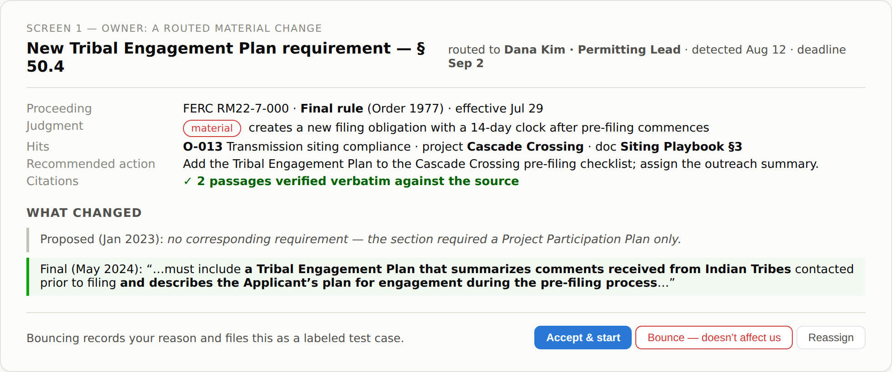
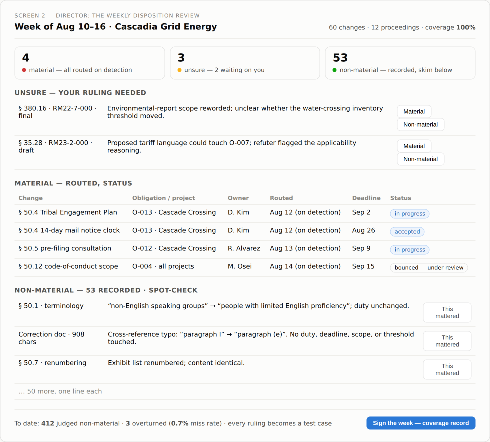
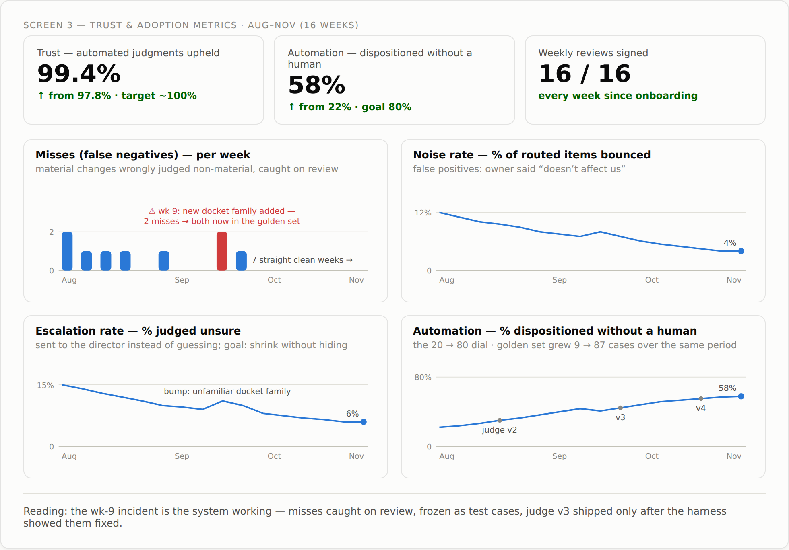

# PRD — Strata: regulatory change intelligence for utilities

**Luke Hornof · August 2026 · AI Fund Build Challenge**

A system that decides which regulatory changes matter to your company, proves every judgment with cited evidence, and gets measurably better each time a human corrects it.

---

## The bet

Finding regulatory changes is a solved problem. The Federal Register has an API; diffing text is fifty-year-old computer science. Anyone can ship a tool that says "something changed in Docket RM22-7."

Deciding which changes *matter to this company* — and proving the ones judged non-material were judged that way for a reason — is not solved, and never fully will be: judgment is sometimes wrong. The bet is a system built around that fact. It shows its evidence, says "unsure" instead of guessing, and publishes its own error rate — and every human correction becomes a permanent test case, so judgment improves measurably while trust holds. Maintained trust plus a self-improving feedback loop is the product; the judgment layer is just where they meet.

This PRD defines the smallest product that wins that trust: one user, one workflow, one jurisdiction, with the feedback loop on the main screen instead of buried in the stack.

## The user

**The Director of Regulatory Affairs at a mid-size utility.** They own the docket calendar, they sign the impact assessments, and they answer to the Chief Compliance Officer when something slips through.

Their pain is **trust, not volume.** "Too much to read" is the analyst's problem, one desk down. The director's problem is *did we miss something, and can I prove we didn't.* When a state examiner or FERC audit asks how the company tracked a rulemaking, "we subscribe to some alerts and the team reads them" is not an answer. The job is demonstrating coverage: everything published was seen, assessed, and dispositioned, by a named person, on a date.

Two people deliberately not chosen:

- **The regulatory analyst**, who reads the dockets and writes the summaries. Their pain is volume. A triage tool serves them — and a better alert feed is explicitly not the wedge.
- **The project permitting lead**, who owns one transmission project and wants a watch on one proceeding. Real need, too narrow to build a company on.

The test that this is one user and not a category: every trust feature in this document — non-material changes recorded instead of deleted, the batched review queue, the published miss rate, exact citations, escalation on uncertainty, the audit log — is load-bearing for the director and unnecessary for the analyst. If the feature list served both, the choice wouldn't be real.

The director is also the buyer. User and purchaser are the same person, which matters for a venture that needs revenue inside twelve weeks.

## Why alerts and search are insufficient

**Search answers questions you already thought to ask.** The director's fear is the change nobody thought to look for. You cannot search for what you don't know exists.

**Search returns documents, not consequences.** It finds the rule; it does not say *this alters obligation O-013, affects the Cascade Crossing project, and the 14-day clock started when pre-filing commenced.* The expensive work — mapping a change onto this company's obligations, projects, and deadlines — starts after the search result comes back.

**Alerts optimize for the wrong error.** An alert feed manages its own liability by over-firing. Every over-fire spends the director's attention, and the 2015–2022 regulatory-tech cohort died of exactly this: alert fatigue turned their products into unread email folders that got cut as nice-to-haves. A tool that cries wolf is worse than no tool, because it manufactures false confidence in coverage.

**Neither leaves a record.** Searching proves nothing to an examiner. An alert opened and skimmed proves nothing. The unit of value is a *disposition* — seen, judged, routed or dismissed with reasoning, signed — and neither search nor alerts produce one.

## The workflow: the weekly disposition review

One screen, one sitting, one signature.

The director opens the week: **60 changes across 12 proceedings. 4 material — routed, each with an owner and a deadline. 53 non-material — one line of reasoning each. 3 unsure — waiting on you.**

They skim the non-material pile, spot-check a few, decide the escalations, approve. The session ends with a signed record of coverage for the week: every published change dispositioned, by whom, on what basis.

Routing does not wait for the sitting. A material change routes to its named owner the day it is detected — the owner gets the task and the deadline immediately, because a 14-day clock does not pause for the calendar. What waits for the week is the director's part: certifying coverage. Owners act on detection; the director signs weekly.

Clicking any change opens the detail view: the exact passage that changed, side by side across versions; whether it is draft or final (a proposed rule signals what's coming; a final rule starts clocks); which obligation it touches; which project; who owns it; what action is proposed. Assign, close, back to the list. That is a screen inside the workflow, not a second workflow.

The weekly review is the only workflow shape where the **non-material pile is visible.** A change-detail view on its own shows only what passed the filter — the non-material pile never appears, so it can never be audited. That pile is where the risk lives.

### What "material" means

From reading a real proceeding (FERC Docket RM22-7-000, three versions across 16 months), a change is material if it alters **what someone must do, by when, who is covered, or a threshold number**: a new or removed obligation, a deadline created or moved, a scope change, a threshold change. Not material: rewording, renumbering, cross-reference fixes, typography.

The same proceeding supplies the product's honesty test. Five days after the final rule, FERC published a 908-character correction that exists to change "paragraph I" to "paragraph (e)". A system that routes that document to a compliance officer has failed. Staying correctly silent is worth more than another true positive.

## How it decides: two steps that fail differently

**Step 1 — find the changes.** Ingest successive versions of a proceeding, separate amendatory instructions from regulatory text, split into sections, diff version against version, classify draft / final / correction. This is code, not a model. It is mechanical, testable, and it converges: every parsing bug becomes a frozen test case, and the parser stops being wrong.

**Step 2 — decide which changes matter.** Classify each change **material / non-material / unsure** against this company's obligations register, projects, and documents. This is judgment. It is open-ended, it will sometimes be wrong, and it only improves — so the product is built around measuring it and improving it rather than pretending it's solved.

Keeping the steps separate is a design decision, not an implementation detail. When step 1 is wrong, the fix is a parser patch and a regression test. When step 2 is wrong, the fix is a labeled example and a measured retest. Collapsing them — feeding raw diffs to a model and hoping — makes every failure ambiguous and every claim uncheckable.

Every judgment carries **citations to the exact source passages** behind it. No claim without a passage.

### Three outcomes, not two

- **Material** → mapped to the specific obligations, projects, and documents it affects; an action recommended; routed to the named owner on detection, with a deadline.
- **Non-material** → **recorded with one line of reasoning that names what the change was checked against** ("touches no Cascadia obligation — checked against the register"). Never routed. Never deleted. Nobody is interrupted; the record survives.
- **Unsure** → escalated to the director on detection, stated plainly as "I don't know," with the evidence laid out. Guessing is the one behavior that would destroy trust, so uncertainty is a first-class outcome rather than a failure state — and the director's ruling becomes a test case.

### The trust loop

Judgments are reviewable, and reviews feed back:

- The non-material pile arrives as a **batched queue** — one line each, skimmable in two minutes — not per-change interrupts.
- **Every human ruling becomes a labeled test case** in the golden set: overturned misses, bounced false positives, rulings on unsure items. The test set grows out of real mistakes instead of imagined ones.
- **No judge change ships without proof.** Any change to the judgment layer — prompt, examples, model — replays the entire golden set and ships only if it scores better, with zero material changes called non-material.
- **The miss rate is published, in the product**: "412 changes judged non-material to date; 3 overturned on review." That number, trending down, is the trust argument in a single line — and it is the director's own review queue producing it, not an engineer's dashboard bolted on the side. The measurement falls out of work they were already doing.

## Trust and adoption metrics

Two dials govern the product, and when they conflict, trust wins:

- **Trust — are the automated judgments correct?** Target ~100%, non-negotiable.
- **Automation — how much human work is saved?** The share of changes dispositioned without a human touching them. It starts low and should climb steadily toward 80%. A flat automation dial over time means a wrong assumption or a broken loop — and it only rises by making the judge better, never by loosening it.

The supporting numbers, separating the failure modes:

- **Miss rate** (false negatives): changes judged non-material later overturned by a reviewer. The liability number. Published in-product, target: monotonically declining. This is the metric the product lives or dies on.
- **Noise rate** (false positives): changes routed as material that the owner bounces back as irrelevant. The alert-fatigue number — the one that killed the predecessors.
- **Escalation rate**: share of changes landing in "unsure." Too high and the product is punting its job; near zero and it is overconfident. Healthy is a settling band, watched rather than targeted.
- **Spot-check depth**: how many non-material one-liners the director expands before signing. Declining spot-checks against a stable miss rate is what trust looks like behaviorally — measured, not asked about in a survey.
- **Coverage**: dispositioned changes / published changes in watched proceedings. Must be 100% by construction; anything less is a silent ingestion failure, which is treated as a product outage.
- **Adoption**: the weekly sign-off itself. A director who signs the record every week has made the product part of how they answer to the CCO. Weekly signed reviews is the only adoption number that matters at this stage.

## How user feedback shaped this document

I contacted fourteen people within the challenge's 48-hour window — seven through LinkedIn (CPUC staff, utility regulatory affairs people via second-degree connections, compliance engineering leads) and seven directly by text. Two substantive replies came back in time, both adjacent to the domain rather than the target user: a VP of Engineering at a regulated fintech company, and a biotech R&D director with FDA-regulated manufacturing experience (enzyme production, quality systems). Several others replied "I've never done this work"; most were silent by build time.

What the fintech reply contributed:

- *"Repeated exercises like game days and tabletops help expose problematic habits."* His trust model for critical systems is continuous exercised testing, not good design — independent support for making the evaluation loop user-facing and continuous rather than a one-time internal benchmark.
- *"You just need to trust your 2–3 folks who must read a ticket and decide 'is this safe' before executing."* His organization concentrates trust in a small number of named, accountable humans at a chokepoint. That sharpened the routing design: route to the named owner of the obligation, never to whoever is free. Accountability, not load-balancing.

The biotech reply, answering "what would you need to see before believing 'these 53 changes don't affect you'":

- *"I would need to see that none of the changes affect processes, formulations, performance specifications, test protocols, etc. that involve liquid or air/liquid interfaces."* He'd only believe a dismissal shown to have been checked against *his named risk surface*. A generic "doesn't apply" is worthless; "checked against these specific things of mine" is credible. **This one changed the product:** a non-material record now names what the change was checked against — "touches no Cascadia obligation; checked against the register" — not just why it's harmless.
- His trust mechanism today is a qualified human verifying a change is operator-actionable *before approval* — the same accountable-human-gate answer the fintech VP gave, arrived at from a different regulated industry.

The fintech VP's two points reinforced decisions already made; the biotech answer sharpened one. Round two — the prototype in front of the same list, plus the outstanding second-degree requests to utility regulatory affairs people — is planned before submission, and the build will change if the answers say it should.

## What it deliberately does not do

**Not the product — positioning:**

- **Not a search tool.** No general Q&A over the corpus. The wedge is a trusted change-to-action workspace.
- **Not an alert feed.** No broadcasts. A material change routes to exactly one named owner; everything else accumulates silently for the weekly review. Nobody's inbox fills with maybes.
- **Not the analyst's triage list.** "Here's what to read this week" serves the user this product declined to choose.
- **No redline drafting.** The natural next step from "here's what changed," and a second product. The director's pain is confidence, not authoring.

**Not in this prototype — scope, designed in the TDD but not built:**

- **No live connectors.** Company context is a fixture, not a sync from SharePoint, GRC, or Jira.
- **No writeback** to Jira or ServiceNow. Routing happens in-product; the integration is specified, not built.
- **One jurisdiction.** Federal Register only. No state PUC dockets yet, no multi-jurisdiction taxonomy.
- **No auth, no multi-tenancy.** Single user, no login. Data isolation and security are designed in the TDD regardless, because the real product cannot exist without them.

## Beyond utilities

The vertical-specific parts of this product are thinner than they look: a corpus adapter (where rules are published), a materiality vocabulary (what "scope" and "threshold" mean in the domain), and the fixture schema for the obligations register. The expensive parts — version-aware ingestion, instruction/text separation, the three-outcome disposition model, the overturn loop, the audit trail — are domain-independent.

Utilities first because the wedge is named and a design partner exists: dockets, rate cases, and siting proceedings are dense, versioned, and public, and the buyer is identifiable. From there, expansion follows the same buyer shape — a named person who signs a coverage record for a regulator:

1. **Adjacent energy** — state PUC dockets for the same utilities (the second jurisdiction is the same customer, deeper), then independent power producers and grid-scale renewables developers.
2. **Insurance** — a 50-state patchwork, a thin modern-vendor field, and a Chief Compliance Officer with the identical "prove we saw it" obligation.
3. **Regulated financial services** — the deepest spend, entered last: the incumbent field is crowded, and the product should arrive with a published miss-rate track record no content-feed incumbent can match.

The compounding asset is per-customer: an obligations register that grows more connected with every dispositioned change, and an audit history that cannot be exported to a competitor. Content was never the moat; every predecessor that bet on content aggregation learned that publicly.

## Twelve weeks and six months

**At twelve weeks** — the residency horizon: the disposition workflow live on the design partner's real proceeding calendar, their actual obligations register loaded, at least one full month of weekly signed reviews completed by a real director, and a miss-rate number that exists — measured on their overturns, published to them. One paying design partner is the goal; the signed weekly review is the proof of value that justifies the invoice.

**At six months:** two to three utility customers running the weekly review as routine; state PUC ingestion for their states (the second jurisdiction, same buyer); the overturn-driven test set as a per-customer asset that makes judgment measurably better each month; and the first structured pull of the company-context model from customer systems, replacing the fixture — the beginning of the sync problem, taken on once the judgment layer has proven itself.

The six-month test of the whole bet: a director who, asked by an examiner how the company tracks regulatory change, answers by opening this product's audit log — and nothing else.

## The screens

Mocked up before implementation, so the PRD and the prototype tell the same story.

**The owner's screen** — a routed material change: what changed (old vs new passage), the judgment with verified citations, the obligation and project it hits, the recommended action. Accept, bounce, or reassign — a bounce is recorded and becomes a test case.

**The director's screen** — the weekly disposition review: material as already-routed status lines, unsure items awaiting a ruling, the non-material pile one line each with the miss rate in the footer, and the sign-off that produces the coverage record.

**The metrics screen** — the two dials and their supporting numbers over 16 weeks. Week 9 is a deliberate bad week: a new docket family lands and two misses appear — then get caught on review, frozen as test cases, and provably fixed before the next judge version ships. The trust story is not "no mistakes"; it is mistakes surfaced, counted, and retired.

